## Nächster Halt: Nur 700 km weiter östlich
Nach unserem Wüstentrip und zwei weiteren Tagen am Kaspischen Meer in Aktau beschlossen wir, weiter Richtung Osten zu ziehen, um Felix’ Schwester Sophie rechtzeitig gegen Ende Juli in Almaty zu treffen. Städte-technisch ist in Westkasachstan ja nicht allzu viel los, daher planten wir unseren weiteren Reiseabschnitt durch Usbekistan. Dies kam uns auch insofern gelegen, als wir Kasachstan aufgrund der geltenden 30-Tagen Visabeschränkung sowieso nochmal verlassen mussten, bevor wir Sophie treffen. Also, nächster Halt: Nokus, ~~Usbekistan~~ _Qaraqalpaqstan_.

Was das Transportmittel betraf, waren wir ein bisschen zwischen Zug und Hitchhiking hin- und hergerissen. Am Ende schwang unsere Stimmung doch ein bisschen Richtung Hitchhiking aus; zugegebenermaßen auch, weil das Buchungssystem der kasachischen Bahn ständig zwischen "keine Plätze verfügbar" und "mehr als 100 freie Plätze" schwankte. Die merklich wenig motivierten Angestellten am Schalter konnten uns zudem nur auf die App verweisen, in der in diesem Moment keine Plätze mehr zur Verfügung standen.
Darüber hinaus waren wir nun ja schließlich auch stolze Besitzter eines Zelts, und immerhin gab es ja auch noch eine ganze Menge weiteres _Nichts_, das wir bisher noch nicht gesehen hatten. Mit einem Kanister Wasser waren wir ebenfalls ausgestattet. Was sollte also schon schiefgehen?



Mit einem Stadtbus ging es in Richtung Stadtrand, denn wie jeder hinreichend geübte _Hitchhiker_ weiß, in der Stadt verliert man nur Zeit. Leider fuhr der Bus nicht ganz in die Richtung, die wir angepeilt hatten. Daher galt es ein Stück zu laufen. Doch schon nach wenigen Metern erblickte uns ein besonders knuffiger 18-Jähriger, der gerade in die Gegenrichtung unterwegs war. Wir hatten noch nicht einmal die _Daumen-Raus-Initiative_ gestartet, da legte er, sobald die Schnellstraße es erlaubte, kurzerhand eine Kertwende ein, um uns dann gute 20 km in die entgegengesetzte Richtung am richtigen Ende der Stadt abzusetzen. Unser junger Chauffeur handelt beruflich unter anderem mit der lokalen Späzialität _Qurt_ (getrocknete, seeehr salzige Käsebällchen) und gab uns direkt 5 Tüten davon mit! Und als wäre das noch nicht genug, ließ er sich nicht davon abbringen uns auch noch mit gefüllten Teigtaschen (Samsa), Chips, Sonnenblumenkernen und einer Menge Kaltgetränke zu versorgen. Das war - abgesehen davon, dass es so dermaßen großzügig war, dass es fast schon schmerzte, das alles auch wirklich anzunehmen - vor dem Hintergrund praktisch, weil wir so mit den folgenden Mitfahrgelegenheiten munter _Weiterverschenken_ spielen konnten. Wir hoffen wirklich, dass wir die Gelegenheit bekommen, diese Gastfreundschaft zu erwidern.

Nach diesem ersten Stopp dauerte es in Summe zwar etwas länger vom Fleck zu kommen, doch wir hatten sehr nette Begegnungen und wurden stets mit Essen und Trinken überhäuft. So wuchs unsere Liste ausländischer Kontakte zumindest rapide an. Mit steigender Distanz zum kühlenden Meer, kletterte das Thermometer nun auch das erste Mal über 40°C und alles lief super, ... bis wir an der Grenze hängen blieben. 



## Grenzüberschreitende Grenzüberschreitung
Ach ja, der Klassiker! Schon die Mitfahrgelegenheit, die uns bis Beineu (der letzten Stadt vor der Grenze) brachte, hatte beiläufig erwähnt, dass der Grenzübergang eventuell nicht klappen könnte. Aber abenteuerlustig wie wir nunmal sind, schenkten wir diesem Hinweis natürlich nicht allzu viel Beachtung. Schließlich kursieren stets viele Gerüchte, welche häufig nicht besonders überzeugend vorgetragen und noch weniger aus der Ferne zu verifizieren sind.

Statt die Nacht also entspannt in diesem Dorf, Beineu, zu verbringen, stellten wir uns direkt wieder an den Straßenrand. Dort verdichteten sich die Hinweise allerdings rasant, als mehr und mehr Fahrer den anfänglichen Verdacht bestätigten. Dickköpfig wie wir sind, wollten wir einen Grenzübertritt trotzdem nicht unversucht lassen. Im schlimmsten Fall, so dachten wir, gibt es laut Karte an der Grenze auch einen Bahnhof an dem wir einfach in den _transgrenzenden_ Zug steigen könnten. Und bald schon nahmen uns zwei Handwerker mit.



Doch siehe da (oh Überraschung!) 80 km weiter direkt an der Grenze, meinen sie es wirklich ernst: Die Grenze ist geschlossen, angeblich wegen Bauarbeiten. Aber mit der Grenz-Durchlässigkeit verhält es sich hier in etwa wie mit quantenmechanischen Auswahlregeln, man muss lange studieren um diese zu verinnerlichen.


  
Nun, der besonders interessierte Leser mag fragen, was heißt _dicht_ in diesem *Grenz*​fall konkret? Eigentlich ist die Grenze nämlich offen. Denn mit dem Zug, der einige Meter weiter geschmeidig über die Grenze rattert, ist die Einreise gar kein Problem. Und auch als LKW-Fahrer kommt man durch, was uns bezüglich der Bauarbeiten-Begründung doch etwas ratlos zurücklässt. Nur eine Überquerung zu Fuß oder im Auto wäre eben eine grenzüberschreitende Grenzüberschreitung.🫷
  


Probieren geht über Studieren, also ließen wir es uns nicht nehmen, die Dehnbarkeit der Regeln und die Beamten an der Grenze zu testen. Zunächst ganz unschuldig mit der Frage, ob wir denn nicht einfach mit einem LKW durchfahren könnten? Aber ihr ahnt es schon: Auch dieser kreative Geniestreich wurde nur mit einem müde lächelnden Stirnrunzeln von den (mit _Counter Strike_ trainierenden) Grenzbeamten abgewiesen. Und dann war da natürlich noch unser kühner Versuch, sie mit Essen milde zu stimmen. 😁 Doch die Herren machten ihrem Berufsethos alle Ehre und blieben standhaft. So reifte in uns wohl oder übel die Einsicht: _Kannste machen nix_. Natürlich ist an der Grenze auch wieder eine ganze Menge _Nichts_, aber diesmal eingezäunt, sodass wir dort noch nicht einmal unser Zelt aufschlagen durften und am späten Abend wieder die 80 km nach Beineu zurückkrebsen mussten. **Och menno!**

Immerhin, so standhaft die Grenzer bei den Regeln blieben, so freundlich und hilfsbereit zeigten sie sich bei der Organisation unserer Rückreise nach Beineu. Nach einer Stunde Wartezeit, die wir angenehm auf dem Sofa im klimatisierten Büro verbringen durften, nahm uns ein von ihnen beauftragter LKW sicher und zügig zurück nach Beineu mit. Übrigens, den Bahnhof an der Grenze gibt es ebensfalls nicht.


  
  


## Das Dorf in das keiner wollte und in das doch alle kamen
Da waren wir also wieder am Anfang; ganz nach dem Prinzip der Monopoly-Ar\*\*\*karte: _Gehen Sie nach Beineu. Begeben Sie sich direkt dorthin. Gehen Sie nicht über die Grenze. Ziehen Sie nicht ₸200 ein_. Und damit nicht genug, denn leider hießen uns die lokalen Gaststätten keineswegs mit offenen Armen willkommen. Als wir wie Maria und Joseph durch die tiefnächtlichen Gassen des Dorfes zogen und um einen bescheidenen Schlafplatz baten, verschloss Herberge um Herberge ihre Pforten. Alle haben wir sie angefragt und alle waren sie voll. Am Ende fanden wir doch noch unseren _Stall_ als sich der junge Rezeptionist in der letzten Herberge dazu erbarmte, uns für die Nacht in seinem Zimmer aufzunehmen. Normale Zimmer und tatsächlich auch die Besenkammer waren schließlich bereits an andere verzweifelte Späteintrudler vergeben. Da hatten wir sie nun also endlich, unsere Herberge. Welche Wonne! Und, nein, was die (göttliche) Empfängnis betrifft, weicht unsere Geschichte wohl oder übel vom Original ab. So eine Weihanchtsgeschichte ist das hier nicht! Nun hatten wir also unseren spätnächtlichen Zufluchtsort, blieb nur noch die Sache mit dem Zug für den nächsten Tag. Doch genau da zeichnete sich schon die nächste Hürde ab, denn, wie sich herausstellte, waren die Herbergen keineswegs voll von begeisterten Touristen, die sich ihr Leben lang auf die Besichtigung dieses Ortes freuten. Nein, das beschauliche Dorf platzte vor gestrandeten Reisenden aus allen Nähten, die allesamt kein Zugticket mehr ergattert hatten. So nun auch wir.



Ganz im Sinne der maximalen Entschleunigung verbrachten wir also einen entspannten Tag, an dem wir uns voll und ganz dem großen, weiten _Nichts_ von Beineu hingaben. Zur treffenden Beschreibung des lokalen Stadtbildes sei auf die Schriften unseres [Bloggerkollegen](https://ridinground.com/2013/12/10/beyneu-guide) verwiesen. Dem haben wir kaum etwas hinzuzufügen - zumal nicht derart schön literarisch. Wohl möchten wir nur anmerken, dass wir diesem Ort, auf den wir sonst nicht gekommen wären, doch seinen eigenen ganz unverfälschten absolut nicht-touristischen Charme abgewinnen können. Und wie - eigentlich überall auf unserer bisherigen Reise - sind auch die Leute hier wieder sehr offen und herzlich, sowohl für einen Plausch als auch ganz wortlos für ein gemeinsames Foto mit oder ohne uns zu haben.


  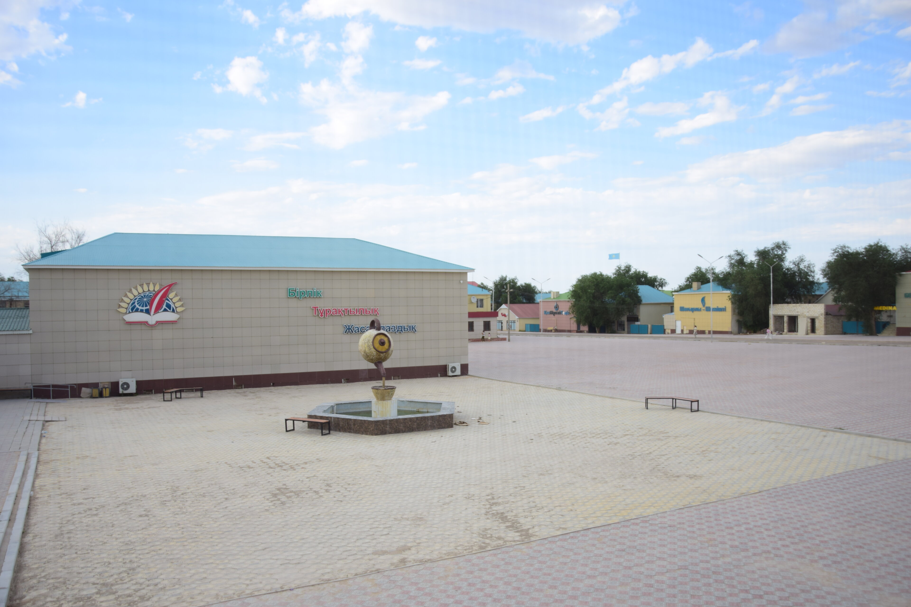
  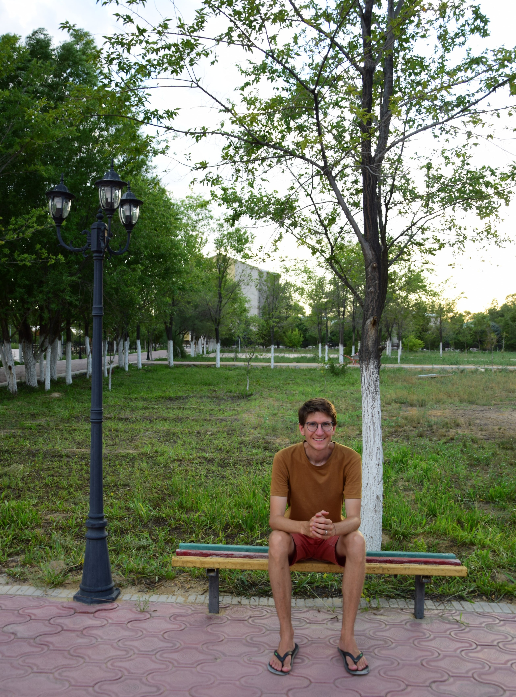
  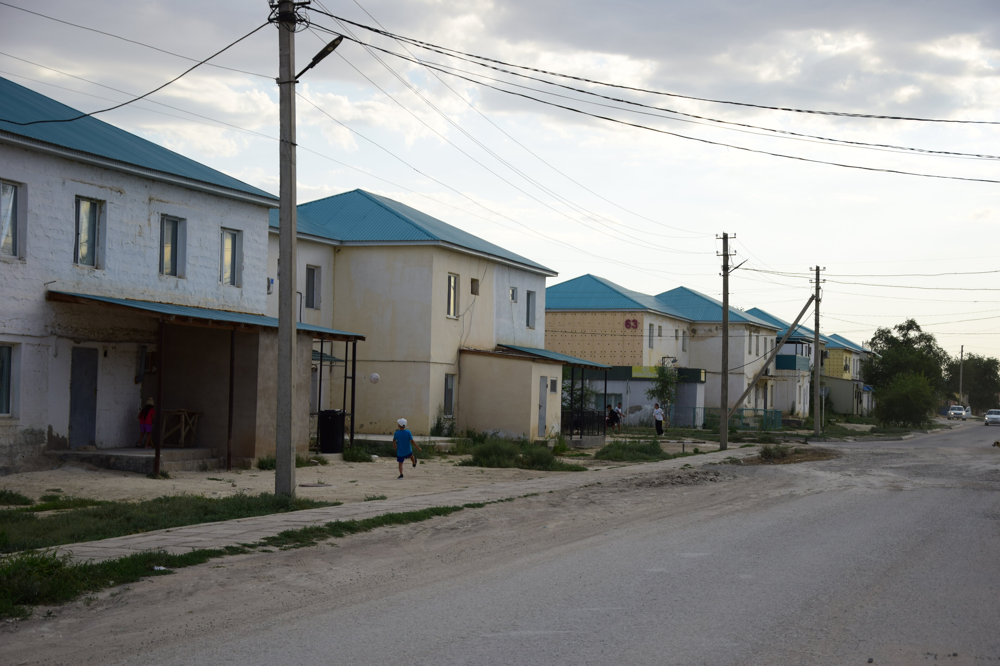
  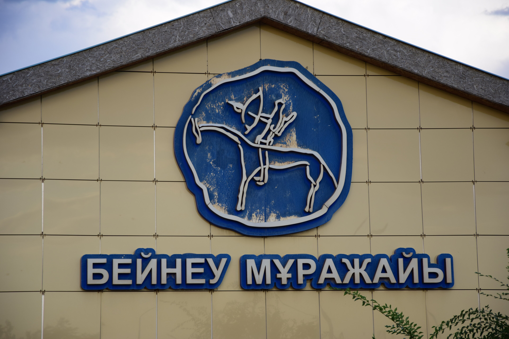
  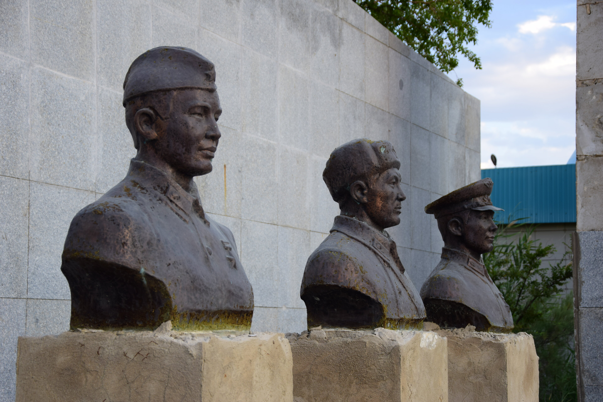
  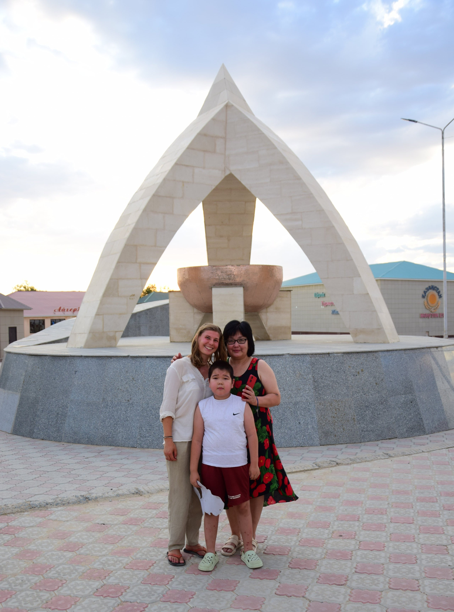
  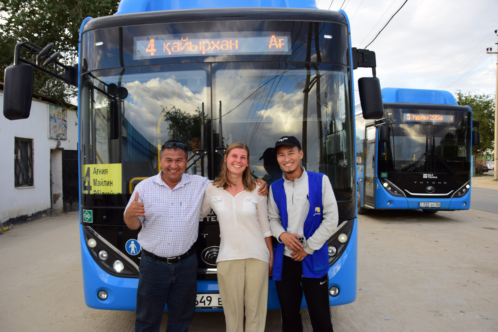


### Ästhetische Züge
Um uns mental auf die bevorstehende Zugreise vorzubereiten, erkundeten wir auch das Bahnhofsgelände und stolperten bei Abendlicht in eine szenische Kulisse: der Güterbahnhof. Wer sagte noch gleich Beineu hätte nichts zu bieten?


  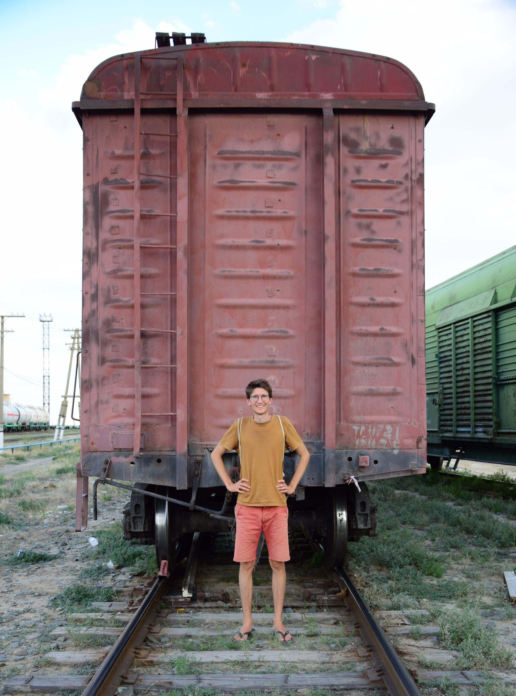
  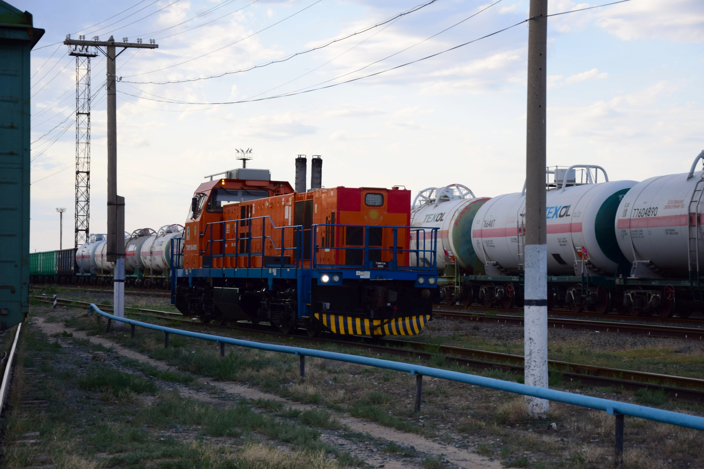
  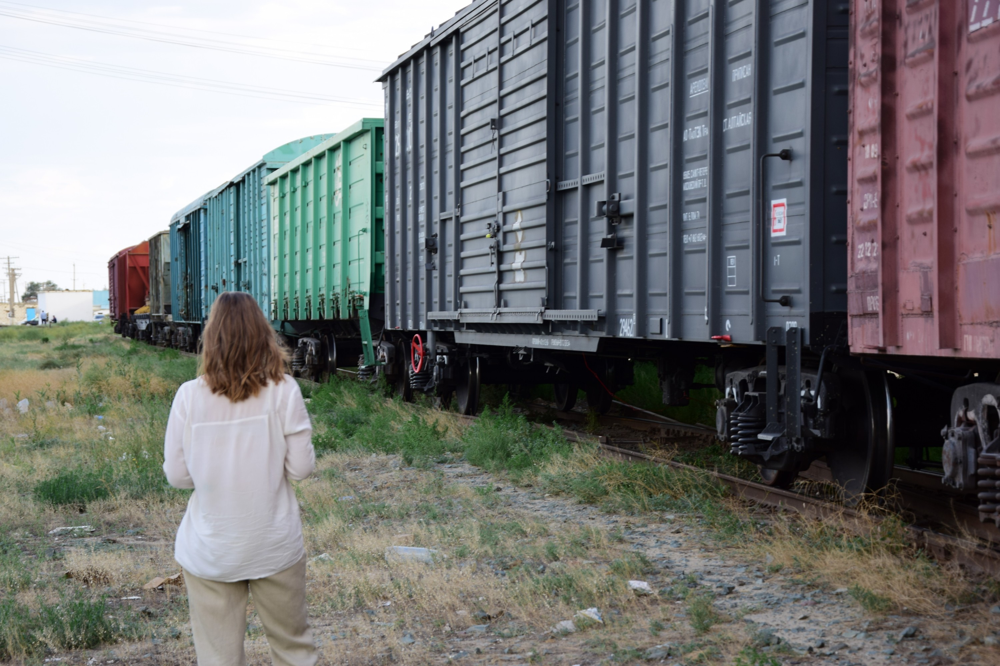
  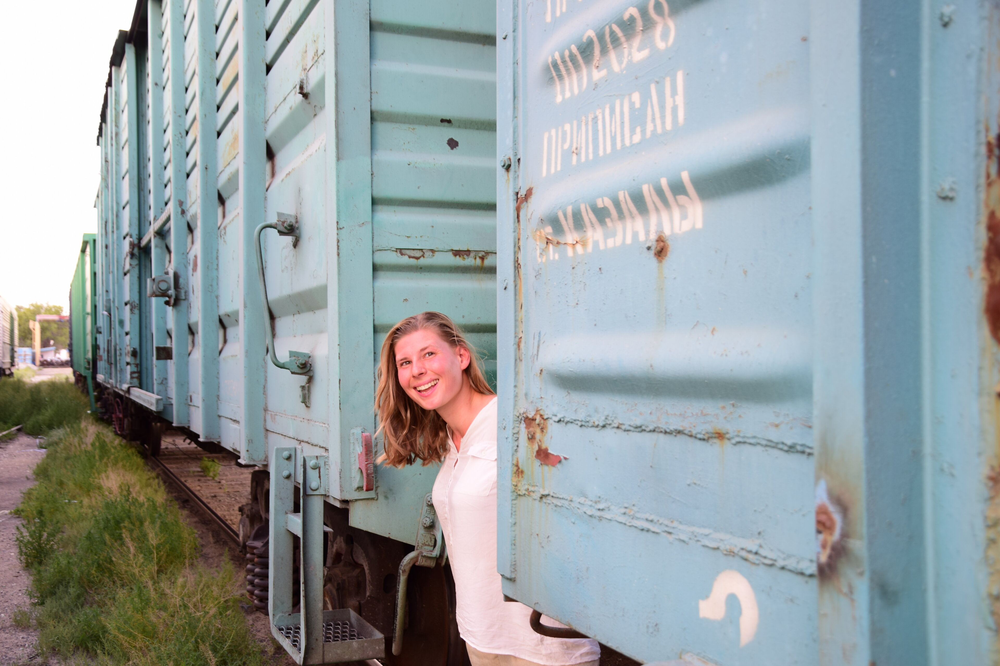
  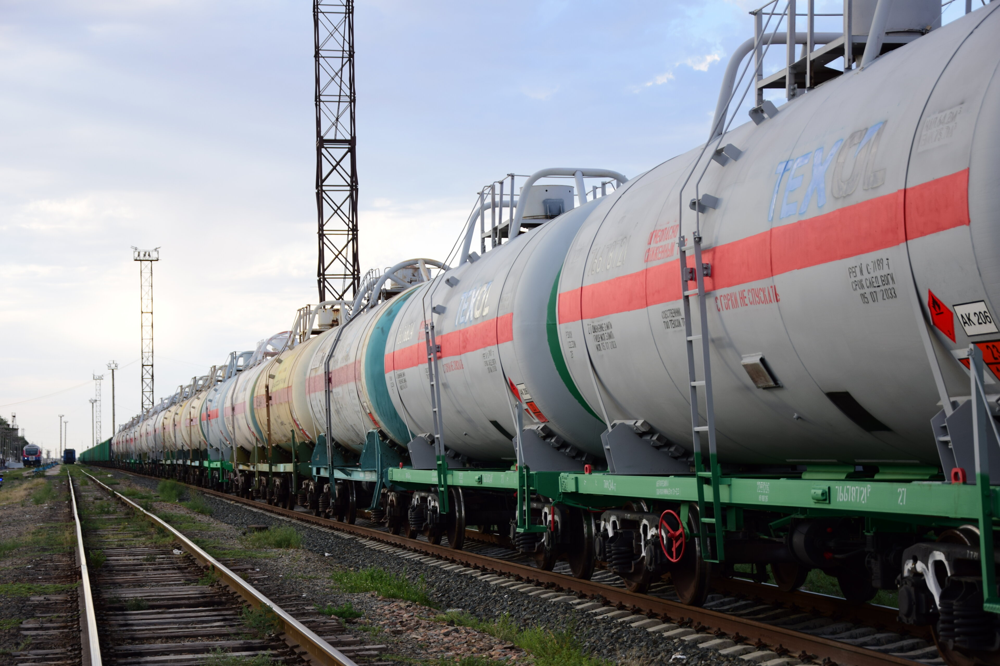


## Klimaanlagen in Zügen sind überbewertet


Von einer Eisenbahngrenzüberschreitung hatten wir in unserem [Armenienpost](/posts/armenia) ja bereits berichtet. Diese Erfahrung war ähnlich und doch irgendwie anders, man könnte auch sagen: um einiges intensiver. Wie bei unserer letzten Zugfahrt fanden die Grenzkontrollen auch diesmal zu den unchristlichsten Zeiten statt, in denen man jeweils eine halbe Stunde bis Stunde vor Erreichen der Grenze unsanft aus dem Schlaf gerissen wird. Auch die Waggons selbst hatten einen ähnlichen Aufbau. Doch die Dichte an Leuten war diesmal ungleich höher, denn der Zug war brechend voll. Bei stickigen 40°C saß man - wer braucht schon eine Klimaanlage? - feucht-fröhlich schwitzend Schulter an Schulter (auf dem untersten Bett) und schuckelte, gewiegt vom rythmischen Klang der ungeschweißten Schienen, vor sich her: __Tschuk-tschuk, tschuk-tschuk, tschuk-tschuk, ...__. Englisch sprach hier ausnahmslaos niemand, was unserem Russisch aber wieder einen kleinen Schubs gab. Und die Stimmung war, aller Hitze, Enge und Müdigkeit zum Trotz, sehr kammeradschaftlich, entspannt und von durchweg netten Gesprächen geprägt. Nachdem dann auch der letzte Koffer ausgiebig kontrolliert war, die Motten, die unser Bett bedeckten weggeweht wurden und der kühlende Fahrtwind wieder über unser Gesichter strich, fielen wir bald in unseren ersten qaraqalpaqstan'schen Schlaf. 😴


